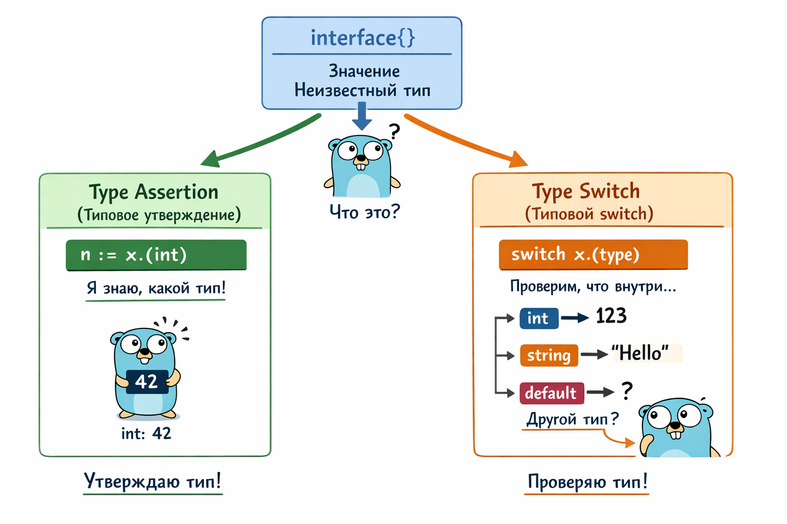

**Система типов** — это способ организации данных в языке программирования, определяющий, как можно хранить, обрабатывать
и использовать эти данные. В Go система типов строгая и статическая — это значит, что каждый элемент данных имеет
четко определенный тип, который проверяется на этапе компиляции.

# Базовые типы данных в Go
**1. Числовые типы**
| Тип            | Размер  | Диапазон                                               | Пример                                |
   | -------------- | ------- | ------------------------------------------------------ | ------------------------------------- |
| int8           | 8 бит   | −128 … 127                                             | `var x int8 = 127`                    |
| uint8 (`byte`) | 8 бит   | 0 … 255                                                | `var x uint8 = 255`                   |
| int16          | 16 бит  | −32 768 … 32 767                                       | `var x int16 = 32767`                 |
| uint16         | 16 бит  | 0 … 65 535                                             | `var x uint16 = 65535`                |
| int32 (`rune`) | 32 бита | −2 147 483 648 … 2 147 483 647                         | `var x int32 = 2147483647`            |
| uint32         | 32 бита | 0 … 4 294 967 295                                      | `var x uint32 = 4294967295`           |
| int64          | 64 бита | −9 223 372 036 854 775 808 … 9 223 372 036 854 775 807 | `var x int64 = 9223372036854775807`   |
| uint64         | 64 бита | 0 … 18 446 744 073 709 551 615                         | `var x uint64 = 18446744073709551615` |
| float32        | 32 бита | ~1.2E−38 … 3.4E38                                      | `var x float32 = 3.14`                |
| float64        | 64 бита | ~2.2E−308 … 1.8E308                                    | `var x float64 = 3.14`                |

**2. Строки**
| Тип    | Размер           | Описание                    | Пример                    |
  | ------ | ---------------- | --------------------------- | ------------------------- |
| string | зависит от длины | Неизменяемая строка в UTF-8 | `var s string = "Привет"` |

**3. Символы**
| Тип  | Размер  | Описание                       | Пример             |
   | ---- | ------- | ------------------------------ | ------------------ |
| byte | 8 бит   | 1 байт (alias `uint8`)         | `var b byte = 'A'` |
| rune | 32 бита | Unicode-символ (alias `int32`) | `var r rune = 'Ж'` |

**4. Логический тип**
| Тип  | Размер | Возможные значения | Пример               |
   | ---- | ------ | ------------------ | -------------------- |
| bool | 1 байт | `true`, `false`    | `var ok bool = true` |

## Преобразование типов
Общие правила:
❌ автоматического преобразования нет
✅ преобразование только явно
формат: T(value)

🔢 **Числовые типы**
| Из            | В                           | Пример                   |
| ------------- | --------------------------- | ------------------------ |
| int → int64   | безопасно                   | `var b int64 = int64(a)` |
| int64 → int   | возможно переполнение       | `var a int = int(b)`     |
| int → float64 | безопасно                   | `f := float64(i)`        |
| float64 → int | дробная часть отбрасывается | `i := int(3.9)` → `3`    |

🔠 **string ↔ []byte / rune**
| Из              | В       | Пример                  |
| --------------- | ------- | ----------------------- |
| string → []byte | байты   | `b := []byte("Go")`     |
| []byte → string | строка  | `s := string(b)`        |
| string → []rune | символы | `r := []rune("Привет")` |
| []rune → string | строка  | `s := string(r)`        |

🔢 **Число ↔ строка**
❌ Нельзя напрямую
✅ Правильно (через пакеты)
| Задача         | Способ              | Пример                                    |
| -------------- | ------------------- | ----------------------------------------- |
| int → string   | strconv.Itoa        | `s := strconv.Itoa(10)`                   |
| string → int   | strconv.Atoi        | `i, _ := strconv.Atoi("10")`              |
| float → string | strconv.FormatFloat | `s := strconv.FormatFloat(f, 'f', 2, 64)` |
| string → float | strconv.ParseFloat  | `f, _ := strconv.ParseFloat("3.14", 64)`  |

🔁 **Преобразование между alias-типами**
| Из           | В        | Пример           |
| ------------ | -------- | ---------------- |
| byte → uint8 | не нужно | `b := byte(10)`  |
| rune → int32 | не нужно | `r := rune('A')` |

## Неявно типизированные константы
Константа без явного типа получает «универсальный» тип:
```go
const x = 1
var i int = x
var f float64 = x
```

# Составные типы данных в Go
**Составные типы данных - это **
- Типы данных, которые **состоят из нескольких значений**
- Строятся на основе базовых типов
- Позволяют группировать и структурировать данные

1. 📦 Массивы (array)
Имеют **фиксированную длину**, которая является частью типа. Массивы хранят элементы одного типа и передаются в функцию
по значению (копируются целиком при передаче)

```go
var arr1 [3]int                 // массив из 3 int, все значения = 0
var arr2 = [3]int{1, 2, 3}      // массив с инициализацией
var arr3 = [...]int{10, 20, 30} // длина определяется автоматически
```
**Когда использовать**
- Когда размер известен заранее
- Когда важна строгая фиксированная структура

2. ✂️ Срезы (slice) 
Это динамическая версия массива, в которой длина не является фиксированной. Срезы хранят ссылку на массив в памяти, 
длину и емкость (len, capacity)
```go
var slice1 []int            // nil-срез
slice2 := []int{1, 2, 3}    // срез с начальными значениями
slice3 := make([]int, 3)   // длина = 3, вместимость = 3
slice4 := make([]int, 3, 5) // длина = 3, вместимость = 5
```
**Когда использовать**
- Для списков данных
- Когда размер заранее неизвестен
- Для работы с коллекциями

3. 🗺️ Карты (map)
**Map** — это встроенный тип данных, который представляет собой ассоциативный массив (словарь): набор пар “ключ → значение”.

Основные свойства:
* Ключи уникальны — один и тот же ключ не может встречаться дважды.
* Неупорядочены — порядок элементов в карте не гарантируется.
* Быстрый доступ по ключу — поиск, добавление и удаление элементов выполняется очень быстро.
```go
var map1 map[string]int              // nil-map (нельзя писать без make)
map2 := make(map[string]int)         // пустая карта
map3 := map[string]int{              // карта с инициализацией
	"apple":  10,
	"banana": 5,
}
```
**Когда использовать**
- Для словарей
- Для поиска по ключу
- Для хранения связей между данными

4. 🧱 Структуры (struct)
**Struct** — это пользовательский тип данных, который объединяет разные типы данных в одну логическую сущность.

Основные свойства:
* Объединяют разные типы данных — внутри одной структуры могут быть int, string, bool и др.
* Описывают одну логическую сущность — например, человека, книгу, заказ.
* Поля имеют имена — к каждому полю можно обращаться по имени.
* Основа моделирования данных в Go — структуры часто используются для представления объектов и передачи данных 
  между функциями.
```go
type User struct {
	ID   int
	Name string
	Age  int
}
```
**Когда использовать**
- Для описания объектов (пользователь, товар, заказ)
- Когда данные логически связаны

5. ➡️ Указатели как составной элемент
Указатель в Go — это тип данных, который хранит адрес другой переменной в памяти. С помощью указателя можно получить 
доступ к значению переменной косвенно и изменять его напрямую. Это позволяет эффективно передавать большие структуры 
в функции, экономить память и управлять данными без копирования. Указатели дают прямой доступ к оригинальной переменной 
и делают код более гибким при работе с памятью.

# Пользовательский тип
Это тип данных, который создаёт программист на основе существующего типа, чтобы сделать код более читаемым, 
структурированным и безопасным. Он может основываться как на базовых типах (int, string), так и на составных 
типах (массивы, срезы, структуры, карты).
```go
// на базе базового типа
type Age int

var myAge Age = 26
fmt.Println(myAge) // 26

// на базе составного типа
type Ages []int       // срез чисел
type People map[string]Age // карта человек → возраст

// с добавлением метода
type Celsius float64

func (c Celsius) ToFahrenheit() float64 {
return float64(c)*9/5 + 32
}

var temp Celsius = 25
fmt.Println(temp.ToFahrenheit()) // 77

```

# Специальный тип (ссылочный)
1. 🧠 Интерфейсы (interface)
   Интерфейс в Go — это тип данных, который описывает набор методов. Любой объект, реализующий эти методы, считается
   совместимым с интерфейсом. Это позволяет работать с разными типами единообразно, не зная заранее конкретный тип объекта.
   Интерфейсы помогают создавать гибкие и расширяемые программы, где важны не конкретные данные, а поведение,
   гарантированное методами интерфейса.
```go
// объявление интерфейса
type Animal interface {
	Speak() string
}
```
**Когда использовать**
- Для абстракций
- Для гибкой архитектуры
- Для подмены реализаций

2. 📡 Каналы (chan)
   Channel — это специальный тип данных для обмена значениями между горутинами (concurrent threads) в Go.
```go
var ch1 chan int        // nil-канал
ch2 := make(chan int)  // небуферизированный канал
ch3 := make(chan int, 5) // буферизированный канал на 5 значений
```
**Когда использовать**
- Для синхронизации
- Для передачи данных между потоками

## 📊 Краткое сравнение

| Тип       | Размер        | Изменяемость | Основное назначение |
|-----------|---------------|--------------|---------------------|
| array     | фиксированный | нет          | строгая структура   |
| slice     | динамический  | да           | коллекции           |
| map       | динамический  | да           | ключ → значение     |
| struct    | фиксированный | да           | модели данных       |
| chan      | динамический  | да           | конкурентность      |
| interface | динамический  | —            | абстракция          |


# Встраивание типов (Embedding)

**Embedding** — это когда один тип встраивается внутрь другого без имени поля.
👉 Go говорит: не «наследуй», а собирай из частей

## 📦 Как выглядит идея
* есть базовый тип (например, Person)
* есть расширяющий тип (Student)
* Student получает поля и методы Person

Но ❗ - это не наследование, а композиция

## 🧠 Что происходит при встраивании
Когда ты встраиваешь тип:
* поля вложенного типа становятся доступны напрямую
* методы вложенного типа прокидываются наверх
* можно обращаться:
    * student.Person.Name
    * student.Name ← Go сам «дойдёт»

```go
package main

import "fmt"

// Базовый тип
type Person struct {
	Name string
	Age  int
}

// Метод базового типа
func (p Person) Info() string {
	return fmt.Sprintf("Name: %s, Age: %d", p.Name, p.Age)
}

// Встраивание типа Person
type Student struct {
	Person // ← embedding (без имени поля)
	Grade  int
}

func main() {
	s := Student{
		Person: Person{
			Name: "Alice",
			Age:  20,
		},
		Grade: 5,
	}

	// Доступ к полям встроенного типа напрямую
```
## 🆚 Embedding vs обычное поле
Обычное поле:
* нужно писать полное имя поля
* нет автоматического прокидывания методов

Embedding:
* доступ к полям напрямую
* методы автоматически доступны
* более чистый код

## 🔄 Методы и Embedding
* Если у вложенного типа есть методы:
* они становятся методами внешнего типа
* внешний тип может:
    * использовать их как есть
    * переопределять
      👉 Если метод объявлен в обоих типах — используется метод внешнего типа

## 📊 Что даёт Embedding
| Возможность                  | Есть?               |
| ---------------------------- | ------------------- |
| Наследование                 | ❌ нет               |
| Композиция                   | ✅ да                |
| Повторное использование кода | ✅ да                |
| Полиморфизм                  | ⚠️ через интерфейсы |
| Переопределение методов      | ✅ да                |

# Типобезопасность и строгая типизация
Go — язык со **строгой и статической типизацией**. Тип каждой переменной известен **во время компиляции**
и не может меняться.

| Аспект               | Описание                                              |
|----------------------|-------------------------------------------------------|
| Типобезопасность     | Нельзя смешивать несовместимые типы                   |
| Проверка ошибок      | Ошибки выявляются **на этапе компиляции**             |
| Роль компилятора     | Защищает от случайных и логических багов              |
| Строгая типизация    | Каждый тип строго определён                           |
| Разные типы          | `int` ≠ `int64`, `string` ≠ `[]byte`                  |
| Автоприведение типов | ❌ Отсутствует                                        |
| Приведение типов     | Только **явное** и всегда заметное                    |
| Запрещено            | Операции и присваивания разных типов                  |
| Результат            | Надёжный и предсказуемый код                          |
| Философия Go         | Минимум магии, максимум ясности                       |


1. Типовые утверждения (type assertions)
   Когда у тебя есть переменная интерфейсного типа (interface{}) и ты знаешь, какой у неё реальный тип,
   ты можешь “утвердить” этот тип и работать с ним напрямую.

```go
// x — переменная интерфейсного типа 
// T — тип, который ты предполагаешь
// value — переменная типа T
// Если реальный тип x не совпадает с T, программа упадёт с panic.
value := x.(T)

// пример
n, ok := i.(int) // i — интерфейс, утверждаем, что i — int 
if ok {
fmt.Println("i это int:", n)
} else {
fmt.Println("i не int")
}

```
2. Type switch
   Если ты не знаешь заранее, какой реальный тип у интерфейсной переменной, можно использовать type switch
   и обработать несколько вариантов.
```go
// v — переменная с утверждённым типом внутри каждой ветки
// x.(type) — специальный синтаксис для type switch
switch v := x.(type) {
case int:
    fmt.Println("int:", v)
case string:
    fmt.Println("string:", v)
default:
    fmt.Println("другой тип")
}
```
