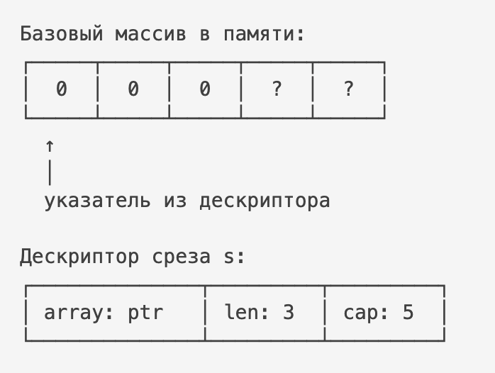

# SLICE - СРЕЗЫ

📌 **Срез (slice)** — это динамическое представление массива. Это не сам массив, а структура-обёртка, которая указывает 
на участок массива и позволяет удобно работать с последовательностью элементов.

## 1. Что такое срез и как он устроен
Срез — это структура из трёх полей:

```go
type slice struct {
    ptr *T      // указатель на первый элемент
    len int     // длина - количество элементов для чтения и записи
    cap int     // емкость - количество элементов, которое можно хранить
}
```

## 2. Создание среза
🔹 От массива (срез не копирует данные, он просто ссылается на массив):
```go
arr := [5]int{10, 20, 30, 40, 50, 60, 70, 80, 90}
sub1 := arr[1:4] // s := arr[low:high], [20, 30, 40, 50]
sub2 := data[2:5:5] // s := arr[low:high:max], [30, 40, 50, 60]
// len = high - low
// cap = len(arr) - low
// max = cap
```
🔹 Через make (создаётся новый массив внутри, и срез на него):
```go
s1 := make([]int, 3, 5) // len = 3, cap = 5
s2 := make([]int, 3) // cap = len
```
🔹 Литерал (Go создаёт массив и возвращает срез на него):
```go
s := []int{1, 2, 3}
```
🔹 Нулевой срез:
```go
var s []int // s == nil → true, len = 0, cap = 0
s1 := []int{} // s == nil → false, len = 0, cap = 0
```

## 3. Операций со срезами 
| Операция              | Пример                      | Что делает                       | Сложность            | Важные нюансы                         |
| --------------------- | --------------------------- | -------------------------------- | -------------------- | ------------------------------------- |
| Создание через make   | `make([]int, 3, 5)`         | Создаёт срез с длиной и capacity | O(n) (инициализация) | Выделяется новый массив               |
| Литерал               | `[]int{1,2,3}`              | Создаёт массив и срез на него    | O(n)                 | Новый backing array                   |
| Нулевой срез          | `var s []int`               | s == nil                         | O(1)                 | len=0, cap=0                          |
| len                   | `len(s)`                    | Возвращает длину                 | O(1)                 | Просто чтение поля                    |
| cap                   | `cap(s)`                    | Возвращает вместимость           | O(1)                 | Просто чтение поля                    |
| Доступ по индексу     | `s[i]`                      | Получить элемент                 | O(1)                 | Panic при выходе за границы           |
| Изменение элемента    | `s[i] = x`                  | Меняет значение                  | O(1)                 | Меняет общий массив                   |
| Сечение               | `s[a:b]`                    | Новый срез на тот же массив      | O(1)                 | Данные не копируются                  |
| Трёхиндексное сечение | `s[a:b:c]`                  | Ограничивает capacity            | O(1)                 | Контроль роста                        |
| append (есть cap)     | `append(s, x)`              | Добавляет элемент                | O(1)                 | Без реаллокации                       |
| append (нет cap)      | `append(s, x)`              | Создаёт новый массив             | O(n)                 | Копирует старые данные                |
| append среза          | `append(s, other...)`       | Добавляет элементы               | O(n)                 | Может вызвать реаллокацию             |
| copy                  | `copy(dst, src)`            | Копирует элементы                | O(n)                 | Копирует min(len)                     |
| Удаление элемента     | `append(s[:i], s[i+1:]...)` | Удаляет индекс i                 | O(n)                 | Сдвиг элементов                       |
| Вставка               | через append+copy           | Вставляет элемент                | O(n)                 | Требует сдвига                        |
| Очистка длины         | `s = s[:0]`                 | Обнуляет длину                   | O(1)                 | Память остаётся                       |
| Обнуление             | `s = nil`                   | Удаляет ссылку                   | O(1)                 | GC может освободить память            |
| Сравнение             | `s == nil`                  | Проверка на nil                  | O(1)                 | Срезы нельзя сравнивать друг с другом |
| Перебор               | `for i,v := range s`        | Итерация                         | O(n)                 | v — копия элемента                    |
| Передача в функцию    | `func f(s []int)`           | Передаётся копия заголовка       | O(1)                 | Массив общий                          |

### 📈 Как растёт capacity (рост среза)
Алгоритм роста:
* если cap < 1024 → удваивается
* если cap ≥ 1024 → растёт примерно на 25%
**Оптимизация: предаллокация**
Если размер данных известен заранее, всегда выделяйте нужную вместимость сразу. Это избавит от реаллокаций 
и фрагментации памяти.
### Алгоритм удаления элемента из среза
```go
// Удаление с сохранением порядка O(n)
// Элементы справа сдвигаются влево -> порядок сохраняется
sub := append(s[:i], s[i+1:]...)

// Удаление без сохранения порядка O(1)
// На место удаляемого кладём последний элемент -> уменьшаем длину
sub[i] = sub[len(s)-1]
sub = sub[:len(s)-1]

// Удаление первого и последнего элемента O(1)
// ⚠ Но: старый элемент остаётся в памяти (в базовом массиве).
// Если элементы — указатели, может быть удержание памяти.
sub1 = sub1[1:] // первого
sub2 = sub2[:len(s)-1] // последнего

// Удаление диапазона O(n)
// Удаляет элементы [i, j)
s = append(s[:i], s[j:]...)

// Удаление по условию (фильтрация) O(n)
// Вариант 1 — новый срез
result := make([]int, 0, len(s))
for _, v := range s {
    if condition(v) {
    result = append(result, v)
    }
}
// Вариант 2 — in-place (эффективнее)
j := 0
for _, v := range s {
    if condition(v) {
    s[j] = v
    j++
    }
}
s = s[:j]
```
### Алгоритм вставки элементов
```go
// Классическая вставка с сохранением порядка O(n)
sub = append(s, 0)          // увеличиваем длину
copy(sub[i+1:], sub[i:])    // сдвигаем элементы вправо
sub[i] = x                  // вставляем элемент

// Вставка через вложенный append O(n)
// Создаётся временный срез -> копируются элементы (возможно несколько аллокаций)
s = append(s[:i], append([]int{x}, s[i:]...)...)

// Быстрая вставка без сохранения порядка O(1) (если хватает capacity)
s = append(s, s[i])
s[i] = x

// Вставка в начало O(n)
// Всегда создается новый массив
s = append([]int{x}, s...)

// Вставка в конец
// амортизированно -> O(1), реаллокация -> O(n)
s = append(s, x)

```

## 4. Работа с многомерными матрицами
В Go **нет** настоящих 2D-массивов как в C. Обычно матрица — это: `[][]T` (срез срезов).
### Создание матрицы
```go
// Вариант 1 - через литерал
matrix1 := [][]int{
    {1,2,3},
    {4,5,6},
}

// Вариант 2 - через make
// Важно! Сначала создаём срез строк -> потом каждую строку отдельно.
rows := 3
cols := 4

m := make([][]int, rows) 
for i := range m {
    m[i] = make([]int, cols)
}
```
📌Важный нюанс — строки независимы => можно сделать строки разной длины:
```go
m := [][]int{
    {1,2},
    {3,4,5},
}
```
Это называется **ragged array**. В Go это нормально.
### Операции с матрицами
```go
// Доступ к элементам O(1)
m[i][j]

// Перебор матрицы O(rows × cols). Вариант 1 - через range
for i := range m {
    for j := range m[i] {
    fmt.Println(m[i][j])
    }
}

// Перебор матрицы O(rows × cols). Вариант 2 - классический цикл
for i := 0; i < len(m); i++ {
    for j := 0; j < len(m[i]); j++ {
    fmt.Println(m[i][j])
    }
}

// Вставка строки O(1)
newRow := []int{7,8,9}
m = append(m, newRow) 

// Удаление строки O(rows)
m = append(m[:i], m[i+1:]...)

// Вставка столбца O(rows)
for i := range m {
    m[i] = append(m[i], value)
}

// Копирование  
// b := m - копирует только верхний уровень
b := make([][]int, len(m))
for i := range m {
    b[i] = make([]int, len(m[i]))
    copy(b[i], m[i])
}

// Транспонирование (строки -> столбцы, столбцы -> строки) O(rows x cols)
res := make([][]int, cols)
for i := range res {
    res[i] = make([]int, rows)
}

for i := 0; i < rows; i++ {
    for j := 0; j < cols; j++ {
		res[j][i] = m[i][j]
    }
}


```
### Как это хранится в памяти
Матрица [][]int — это:
* массив указателей на строки
* каждая строка — отдельный массив

Это значит:
* строки могут лежать в разных местах памяти
* кэш-локальность хуже, чем у "настоящей" 2D матрицы